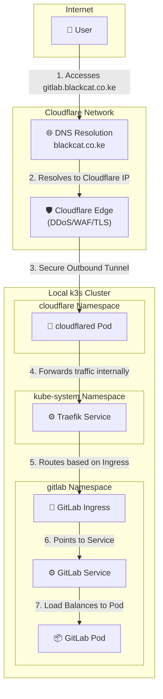

# GitLab on k3s

This repository contains the full configuration for deploying a self-hosted GitLab CE instance on a k3s cluster. The entire system is managed declaratively using GitOps principles.

## GitOps Workflow

This project uses **Argo CD** to ensure that the state of the live Kubernetes cluster is an exact reflection of the manifests in this Git repository. Git is the single source of truth. Manual changes to the cluster are automatically detected and corrected.

The workflow is as follows:

1. **Bootstrap:** After a clean `k3s` cluster is running, Argo CD is installed. A single root application manifest (`bootstrap/root-app.yaml`) is applied manually with `kubectl`.

2. **Automation:** The `root` application automatically creates any other "child" applications defined in the `/apps` directory.
3. **Synchronization:** Each child application, such as `cluster-infra`, points to a directory containing its Kubernetes manifests (e.g., `/infrastructure`). Argo CD deploys and manages all resources defined in that directory.
4. **Updates via Git:** To make any change to the system—such as updating an application version or changing a configuration—a developer simply commits and pushes a change to the manifests in this repository. Argo CD detects the new commit and automatically applies the changes to the cluster. **`kubectl apply` is never used directly.**

## Repository Structure

The repository is organized to clearly separate the definition of applications from their configuration.

```
.
├── apps/
│   ├── cluster-infra.yaml
│   └── gitlab-app.yaml
├── bootstrap/
│   └── root-app.yaml
├── infrastructure/
│   ├── cert-manager/
│   ├── cloudflare/
│   └── gitlab/
└── README.md
```

* **`bootstrap/`**: Contains the initial manifest to bootstrap the entire GitOps system. This is the only manifest ever applied manually.
* **`apps/`**: Contains Argo CD `Application` manifests. Each file in this directory defines a deployable component (like `cluster-infra`) and tells Argo CD where to find its configuration source code.
* **`infrastructure/`**: Contains the actual Kubernetes manifests (Deployments, Services, Helm values, SealedSecrets, etc.) for all the applications defined in `/apps`. This is the directory that holds the desired state of the cluster.

### Architecture

The following diagram illustrates the flow of traffic from a user on the internet to the GitLab application running in the local `k3s` cluster.



## Observability

To provide operational insight into the cluster and the GitLab application, this project deploys a resilient observability stack for metrics and logging, managed entirely via GitOps.

### Technology Stack & Architecture

* **Metrics:**
  * **Prometheus:** Deployed via the `kube-prometheus-stack` chart. It automatically discovers and scrapes metrics from all cluster components and GitLab. Metrics are stored on a **persistent volume**, ensuring data survives pod restarts and redeployments.
  * **Grafana:** Provides visualization for all Prometheus metrics.

* **Logging:**
  * **Loki:** The central log aggregation system with a persistent volume for log storage.
  * **Promtail:** Deployed as a `DaemonSet`, it automatically discovers all pods, collects their logs, and forwards them to Loki.

### How to Access Grafana

1. **Retrieve the Admin Password:** The Grafana administrator password is automatically generated and stored securely in the cluster. Run the following command to retrieve it:

    ```bash
    kubectl get secret grafana-admin-credentials -n monitoring -o jsonpath='{.data.admin-password}' | base64 --decode ; echo
    ```

2. **Forward the Port:** Run the following command in your terminal. It will remain active as long as the command is running.

    ```bash
    kubectl port-forward svc/monitoring-grafana -n monitoring 8080:80
    ```

3. **Open in Browser:** Navigate to `http://localhost:8111`.

4. **Log In:**
    * **Username:** `admin`
    * **Password:** Use the password you retrieved from the command in Step 1.

### What to Explore

Once logged in, you can explore the health of the entire system:

1. **Kubernetes Dashboards:** Navigate to `Dashboards` -> `Browse`. You will find pre-built dashboards for monitoring overall cluster health, node resource usage, and individual pod performance.
2. **GitLab Metrics:** Look for dashboards related to GitLab to see application-specific metrics.
3. **Explore Logs with Loki:**
    * On the left-hand menu, click the "Explore" compass icon.
    * At the top, select the **"Loki"** data source.
    * You can now run queries to see logs from any application. For example, to see the logs for the GitLab web application, use the LogQL query: `{namespace="gitlab", app="webservice"}`.
