# GitLab on k3s

This repository contains the full configuration for deploying a self-hosted GitLab CE instance on a k3s cluster. The entire system is managed declaratively using GitOps principles.

## GitOps Workflow

This project uses **Argo CD** to ensure that the state of the live Kubernetes cluster is an exact reflection of the manifests in this Git repository. Git is the single source of truth. Manual changes to the cluster are automatically detected and corrected.

The workflow is as follows:

1. **Bootstrap:** After a clean `k3s` cluster is running, Argo CD is installed. A single root application manifest (`bootstrap/root-app.yaml`) is applied manually with `kubectl`.

2. **Automation:** The `root` application automatically creates any other "child" applications defined in the `/apps` directory.
3. **Synchronization:** Each child application, such as `cluster-infra`, points to a directory containing its Kubernetes manifests (e.g., `/infrastructure`). Argo CD deploys and manages all resources defined in that directory.
4. **Updates via Git:** To make any change to the system—such as updating an application version or changing a configuration—a developer simply commits and pushes a change to the manifests in this repository. Argo CD detects the new commit and automatically applies the changes to the cluster. **`kubectl apply` is never used directly.**

## Repository Structure

The repository is organized to clearly separate the definition of applications from their configuration.

```
.
├── apps/
│   ├── cluster-infra.yaml
│   └── gitlab-app.yaml
├── bootstrap/
│   └── root-app.yaml
├── infrastructure/
│   ├── cert-manager/
│   ├── cloudflare/
│   └── gitlab/
└── README.md
```

* **`bootstrap/`**: Contains the initial manifest to bootstrap the entire GitOps system. This is the only manifest ever applied manually.
* **`apps/`**: Contains Argo CD `Application` manifests. Each file in this directory defines a deployable component (like `cluster-infra`) and tells Argo CD where to find its configuration source code.
* **`infrastructure/`**: Contains the actual Kubernetes manifests (Deployments, Services, Helm values, SealedSecrets, etc.) for all the applications defined in `/apps`. This is the directory that holds the desired state of the cluster.

### Architecture

The following diagram illustrates the flow of traffic from a user on the internet to the GitLab application running in the local `k3s` cluster.

```mermaid
graph TD
    subgraph Internet
        User["👤 User"]
    end
    subgraph "Cloudflare Network"
        DNS["🌐 DNS Resolution<br>blackcat.co.ke"]
        Edge["🛡️ Cloudflare Edge<br>(DDoS/WAF/TLS)"]
    end
    subgraph "Local k3s Cluster"
        subgraph "cloudflare Namespace"
            Tunnel["🔗 cloudflared Pod"]
        end
        subgraph "kube-system Namespace"
            TraefikSvc["⚙️ Traefik Service"]
        end
        subgraph "gitlab Namespace"
            GitLabIngress["🔀 GitLab Ingress"]
            GitLabSvc["⚙️ GitLab Service"]
            GitLabPod["📦 GitLab Pod"]
        end
    end

    User -- "1. Accesses gitlab.blackcat.co.ke" --> DNS
    DNS -- "2. Resolves to Cloudflare IP" --> Edge
    Edge -- "3. Secure Outbound Tunnel" --> Tunnel
    Tunnel -- "4. Forwards traffic internally" --> TraefikSvc
    TraefikSvc -- "5. Routes based on Ingress" --> GitLabIngress
    GitLabIngress -- "6. Points to Service" --> GitLabSvc
    GitLabSvc -- "7. Load Balances to Pod" --> GitLabPod
```


